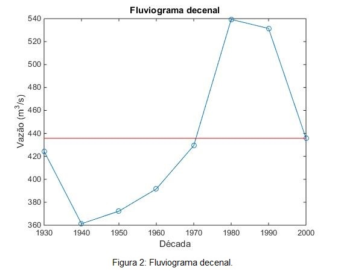
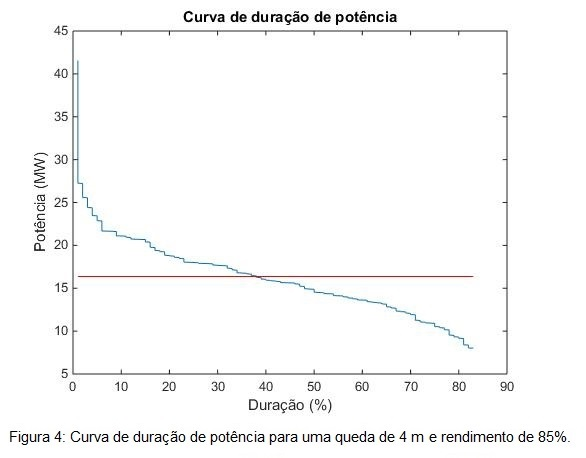

# ProjetoHidrologico
### Projeto Hidrológico

O projeto hidrológico consistirá na realização e apresentação de cálculos hidrológicos para o projeto de uma central hidrelétrica. Cada item deverá ser respondido neste documento do repositório, usando a ferramenta de edição.

  - Com os dados de vazão usados no projeto do aproveitamento, os grupos deverão identificar e organizar os dados em médias semanais (Se a disposição dos dados for diária) ou anuais (Se a disposição dos dados for mensal);
  
  - Cada grupo deverá realizar uma caracterização estatística destes dados. Para a caracterização dos dados, o grupo deverá utilizar de programação, onde a linguagem de programação é de livre escolha do grupo. **O algoritmo programado deverá ser enviado ao repositório via *upload*. Não será permitida a utilização de planilhas excel ou de programas já feitos**. Os seguintes itens deverão ser respondidos neste documento:
  
       - Fluviograma dos dados, dispostos em valores anuais e decenais;
       
       
       
       
       
       - Curva de duração de vazões;
       
        
       
       - Curva de duração de potência para uma queda (Determinada no projeto do aproveitamento) e rendimento de **85%**;
       
       
       - Diagrama de Rippl;   
       

       - Determinação do período crítico;   
       
       A partir da Figura 6, pode-se determinar o período crítico, que é aquele que resulta na maior capacidade do reservatório. Considerando um coeficiente de regulariação de vazão igual a 1, ou seja, tomando a vazão necessária como a vazão média dos dados disponibilizados, temos que o período crítico é aproximadamente entre maio e dezembro.
       
       
        
       - Determinação de períodos seco e úmido;
      
      O período seco corresponde aos meses do ano hidrológico em que ocorre o período crítico, ou seja, no caso analisado corresponde ao meses entre maio e dezembro.
       Já o período úmido são os meses restantes, no caso analisado, os meses de janeiro, fevereiro, março e abril.
        
       - Determinação de valores extremos;
       
       Como os dados do ano hidrológico e do ano civil são muito próximos para o nosso caso, pode-se admitir que são iguais. Com isso, a partir da Figura 6, é possível determinar os valores de vazão máxima e vazão mínima, os quais correspondem a 900 m³/s e 260 m³/s, respectivamente.
        
       - Estimativa da vazão firme e da vazão de projeto para dimensionamento de uma central hidrelétrica;
       
       A vazão firme é definida como a mínima vazão com que se pode contar e que possui uma frequência de ocorrência de, no mínimo, 95%. Com isso, a partir da Figura 3, definiu-se a Vazão Firme do projeto como sendo de 210 m³/s. E como a vazão de projeto deve ser menor que a vazão firme, definiu-se a Vazão de projeto como sendo 200 m³/s.
        
      
       - Cálculo da vazão regularizada: O grupo deverá fazer um cálculo da vazão regularizada baseado nos dados fornecidos de vazão. O método a ser usado é o método de Conti-Varlet. A formulação deste método está disponível no livro-texto do curso (Souza, Z., Santos, A. H. M e Bortoni, E. C.  **Centrais Hidrelétricas: Implantação e Comissionamento**, 2a. Edição, Editora Interciência.). Para este cálculo o grupo deverá:
        
       - Usar o programa disponibilizado pelo livro-texto do curso ou implementar o método em uma linguagem de programação da escolha do grupo. Caso o grupo escolha a segunda alternativa, **o algoritmo programado deverá ser enviado ao repositório via *upload***;
       
       - Análisar o resultado obtido de vazão regularizada e comparar este resultado com as vazões firme e de projeto calculados anteriormente;
       
       Para a realização do cálculo da vazão regularizada, foi utilizado o programa  Centrais Hidrelétricas, disponível em https://www.editorainterciencia.com.br/index.asp?pg=downloads.asp&token= que se encontra no livro Centrais Hidrelétricas: Implantação e Comissionamento, de Souza, Z. Santos A. H. M e Bortoni, E. C. Foi utilizado a função/programa Conti, que tem como entradas os dados de vazão obtidos para o estudo de caso, o volume útil de regularização, percentual do volume inicial e final do reservatório, número de discretizações e número de iterações. Para o caso deste estudo foi estabelecido o mesmo critério utilizado no livro texto, onde se determinou 78 como o número de discretizações e 3 o número de iterações. 
       
       Com a simulação do programa, foram obtidos um novo arquivo de saída com as vazões e os dados de vazão, e volume para regularização total, sendo esses equivalentes à 704,13 m³/s e 19820144 m³respectivamente. 
       
       O valor da vazão regularizada obtido nessa simulação é consideravelmente maior do que os valores de vazão firme e de projeto estimados previamente. Essa diferença tem impacto direto no tamanho do reservatório a ser construído de modo a regularizar a vazão. Sendo a vazão necessária para tocar o empreendimento tão maior do que a vazão que se pode contar com regularidade, o reservatório deverá ser grande de modo a acumular água nos períodos úmidos e permitir o aumento da vazão no período seco.
        
  - Projetos que não tiverem todos estes itens respondidos ou que estiverem incompletos **não serão avaliados!**
Este projeto deverá ser feito neste arquivo até o dia **23/09/2018**. Pedidos de adiamento só serão concedidos em casos excepcionais, a serem decididos pelo professor.

### Projeto do Conduto

O projeto do conduto consistirá na realização e apresentação de cálculos de condutos e canais para a central hidrelétrica. 

  - Projeto do canal para a futura usina hidrelétrica utilizando as fórmulas de Chezy, determinando de acordo com os dados de vazão de cada grupo:
  
     
       -A melhor forma geométrica de seção para o canal em questão;
       
       - O diâmetro hidráulico da seção;
       
       - Velocidade da água no canal;
       
       - Vazão de água no canal;
       
      
  - Baseado nos valores de queda dispostos no projeto do aproveitamento, o grupo deverá inserir no desenho esquemático deste projeto os seguintes itens:
        
       - Valores de cota de altura;
       - Alturas de queda;
       - Linhas piezométrica e de energia;
        
  - Determinação do semiperíodo da onda de pressão para dimensionamento do conduto fechado. Cada grupo poderá fazer as considerações que achar necessárias;
  
  - Determinação de valores de golpe de aríete positivo máximo;
  
  - Determinação de valores do golpe de aríete aceitável;
  
  - Projetos que não tiverem todos estes itens respondidos ou que estiverem incompletos **não serão avaliados!**
Este projeto deverá ser feito neste arquivo até o dia **07/10/2018**. Pedidos de adiamento só serão concedidos em casos excepcionais, a serem decididos pelo professor.
